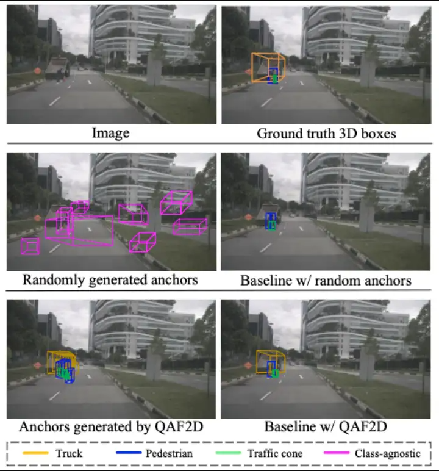
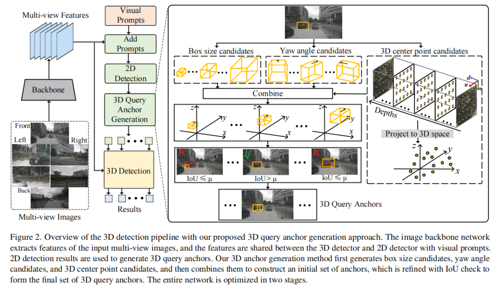

# QAF2D 介绍

## 概述

&emsp;&emsp; Nullmax 多相机3D目标检测新方法 QAF2D

MCSD: An Efficient Language Model with Diverse Fusion

- arxiv: [https://arxiv.org/abs/2403.06093](https://arxiv.org/abs/2403.06093)

## 研究背景

### 实验动机

利用摄像头捕获的多视图图像进行 3D 物体检测在自动驾驶系统中发挥着重要作用，与基于 LIDAR 的方法相比，基于摄像头的方法具有部署成本低的优点。尽管在过去几年中取得了显着的进展，但由于缺乏深度信息和小物体尺寸，基于多相机的3D物体检测仍然是一项具有挑战性的任务。

作者发现在某些情况下（例如远距离区域），流行的2D对象检测器比最先进的3D检测器更为可靠。为了提升基于查询的3D对象检测器的性能，论文提出了一种新的查询生成方法QAF2D。此方法的核心思想是利用2D检测的高可靠性来辅助3D检测，以提高后者的性能。

### 论文贡献

（1）提出从2D边界框生成3D查询锚，以便可以直接使用更可靠的2D检测器的结果来提高3D检测性能；

（2）通过视觉提示在3D和2D检测器之间共享图像特征提取主干，以提高效率，并成功分为两个阶段训练网络；

（3）所提出的QAF2D集成到三个基于查询的3D对象检测器中时，在nuScenes数据集上实现了一致的性能改进。

## 二、整体框架

Nullmax提出了一种提升3D目标检测的新方法QAF2D（Query Anchor From 2D），通过2D检测结果指导生成3D查询锚点（Query Anchor），显著提升了多相机3D目标检测的性能。同时，Nullmax利用视觉提示（Visual Prompt）设计了一套两阶段的优化方法，让2D和3D检测器共用图像特征提取网络，在不影响3D检测器性能的情况下，降低模型训练和部署的资源消耗。

因为对象的 3D 中心的投影位于 2D 框内，所以首先对 2D 框内的一组投影中心进行均匀采样，对于每个中心，将其与深度、3D 大小和偏航角候选相关联以生成 3D 锚点。再根据目标框的类别，为每个检测到的 2D 框选择相应的 3D 尺寸。然后，将初始集中的每个3D锚点投影回2D图像，计算投影框与相应正确2D框之间的IoU，并且仅使用IoU大于阈值的锚点来构造3D查询。

整体框架采用2阶段训练网络：

（1）多相机图像输入到特征提取主干（ResNet或VovNet）提取特征；

（2）再输入给2D检测分支得到2D边界框；

（3）由3D锚点生成器位每个2D边界框生成一组3D锚点以及参数（相机内外参+类别信息）；

（4）随后通过基于查询的3D检测器将2D图像特征以及生成的3D锚点作为输入来预测3D边界框。
