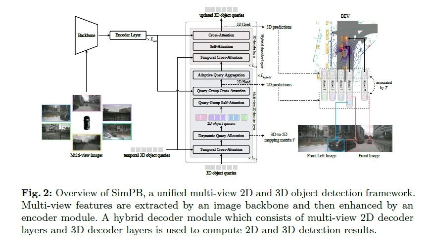

# SimPB 介绍

## 概述

&emsp;&emsp; SimPB实现多相机BEV和图像空间同时检测

Enhancing 3D Object Detection with 2D Detection-Guided Query Anchors

- arxiv: [https://arxiv.org/abs/2403.10353](https://arxiv.org/abs/2403.10353)

##

Nullmax 提出了统一的目标检测模型，能够以端到端、单阶段的方式同时检测透视视图中的 2D 目标和 BEV 空间中的 3D 目标，并自动实现2D-3D Box之间的关联，通过循环迭代的方式将2D和3D的结果持续交互，充分发挥图像空间和BEV空间的检测优势，实现了出色的多相机2D和3D检测效果。

对自动驾驶而言，视觉感知是一项关键技术，尤其是利用车辆周身的多颗相机准确全面地感知周围环境，意义重大。从基础的2D目标检测，到基于多相机配置直接在BEV空间推理3D目标，在复杂的自动驾驶应用中都发挥着重要作用。灵活运用不同的感知算法，不仅可以实现最佳的感知性能，而且可以提升自动驾驶系统整体的鲁棒性，提升安全。

比如，图像空间的2D检测极为成熟，在远距离和小目标检测方面优势明显，如果将2D检测信息用于BEV空间的3D检测，那么自动驾驶整体的检测性能可以进一步提升，改善漏检、误检、感知不远的情况。而Nullmax提出的新方法SimPB，不仅实现了2D和3D信息的同时输出，而且循环迭代、持续交互，感知性能更加优秀。在高阶智驾功能和多相机配置日益普及的当下，这一方法拥有巨大的应用价值。

同样在今年，Nullmax在视觉感知方面的另一项研究《Enhancing 3D Object Detection with 2D Detection-Guided Query Anchors》也获得了计算机视觉顶会CVPR 2024的录用，研究成果接连获得全球认可，持续证明了Nullmax在自动驾驶方面的卓越技术能力，尤其是国际顶尖的视觉感知技术。
