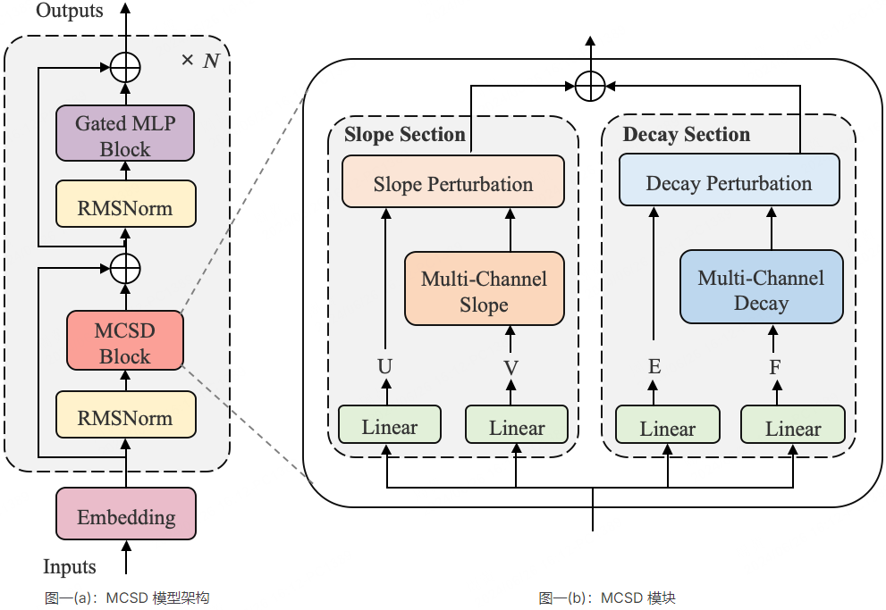
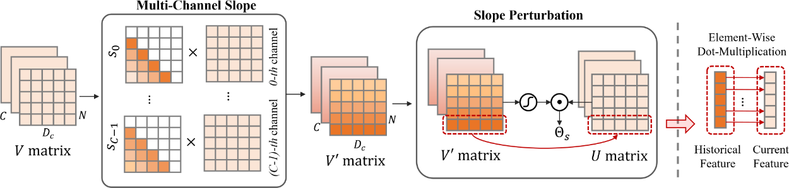
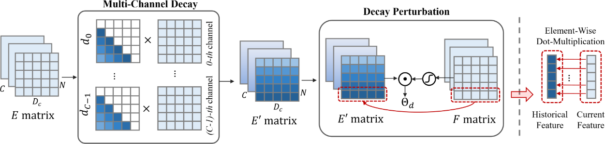
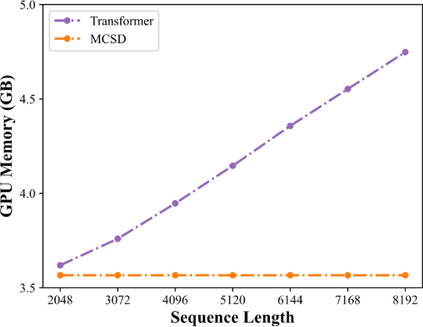
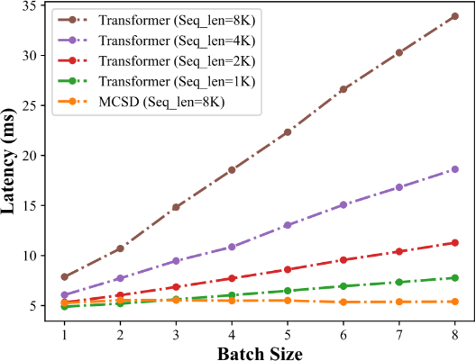
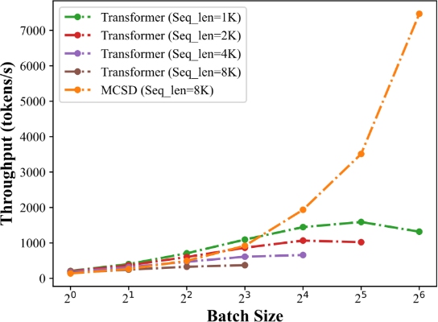
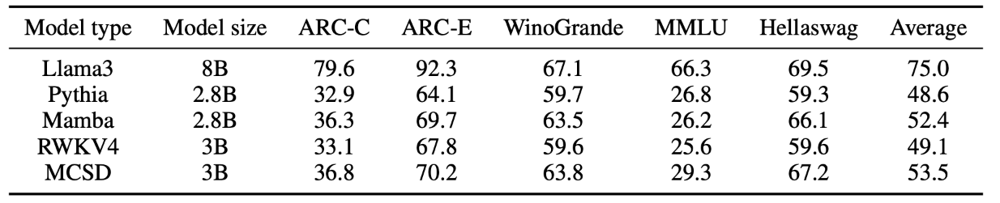

# MCSD介绍

 [MCSD- An Efficient Language Model with Diverse Fusion.pdf](yan/MCSD- An Efficient Language Model with Diverse Fusion.pdf)

## **概述**
&emsp;&emsp;Yan架构大模型当前最新版本为Yan1.2，MCSD是其中的一个重要模块。
## **整体结构**
&emsp;&emsp;Transformer因其能够并行训练和全局注意力机制而在自然语言处理（NLP）领域得到广泛采用。然而，在自注意力中使用矩阵乘法会导致计算复杂度高和推理速度慢。为了解决这些限制，我们提出了MCSD架构，一种新颖的语言模型架构，具有轻量级部署和快速推理能力。整体框架如图一(a)所示。

&emsp;&emsp;其中，MCSD模块图一(b)是MCSD模型的核心之处，它通过斜率变换和指数衰减两个部分提取输入数据中的当前和历史信息，并进行位置感知的多通道特征融合。

## **核心结构**
&emsp;&emsp;图二以及图三演示了斜率变换和指数衰减部分的具体流程，之后应用元素粒度的两类特征扰动操作，分别获取门控筛选后的当前以及历史特征，最后经过进一步融合后使得特征表达更加丰富，整体模型更加有效。

图二：斜率变换-特征提取以及扰动流程

图三：指数衰减-特征提取以及扰动流程

# **模型特征**
## **推理效果**
&emsp;&emsp;在推理阶段，我们将推理过程优化为循环表示的形式，将时间复杂度和空间复杂度分别降低到O(N)和O(1)。并且通过实验数据表明，与Transformer相比，MCSD有着更低的GPU内存消耗（图四）、更低的响应延迟（图五）以及更高的吞吐量（图六）。
### **超低显存，超稳占用**
&emsp;&emsp;具体而言，由图四可以看到，由于 KV 缓存的存在，Transformer的内存成本在推理过程中线性增加。相比之下，即使对于长序列，MCSD的内存消耗也几乎保持不变，并且在 2048 至 8192 的序列长度区间内，MCSD与Transformer 相比具有更低的内存占用，从而更适用于小内存终端设备。

图四：MCSD 和 Transformer 的 GPU 内存用量对比

### **超低延迟，超快响应**
&emsp;&emsp;响应延迟是显著影响用户体验的关键点。根据图五的实验结果表明，Transformer的响应延迟会随着批量大小的增长而呈现近似线性的增长。并且当序列长度增加时，响应延迟增长速度要更快。这严重限制了Transformer对于长序列输出的适用性。而MCSD的延迟则远远小于Transformer，并且在不同批次大小下保持着稳定的响应延迟。

图五：MCSD 和 Transformers 的响应延迟对比

### **超高吞吐，超高并发**
&emsp;&emsp;此外，MCSD的吞吐量会随着批次大小的增加而快速增长，而Transformer则是缓慢提升，甚至在批次大小大于16的情况下出现因KV缓存机制而导致内存不足的问题。因此在达到一定的批次大小情况下，MCSD表现出比Transformer明显更高的吞吐性能。

图六：MCSD 和 Transformers 的吞吐量对比

# **模型效果**

表一：主流评测集中MCSD与其他模型的准确率比较（5-SHOT）

&emsp;&emsp;在拥有优异的推理性能外，MCSD在基准测试中也能保持着与更大规模的LLM相当的效果（表一）。基于卓越的推理性能、较低的部署成本以及不俗的模型效果，MCSD架构大模型为LLM的端侧部署以及人工智能的发展提供了一个全新的方向。
